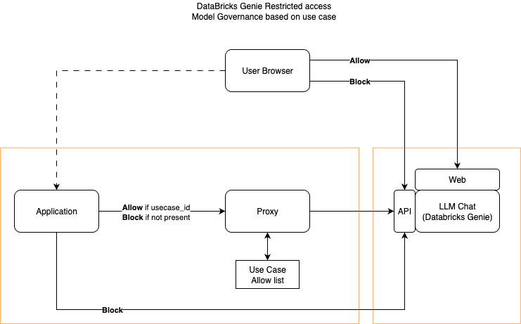
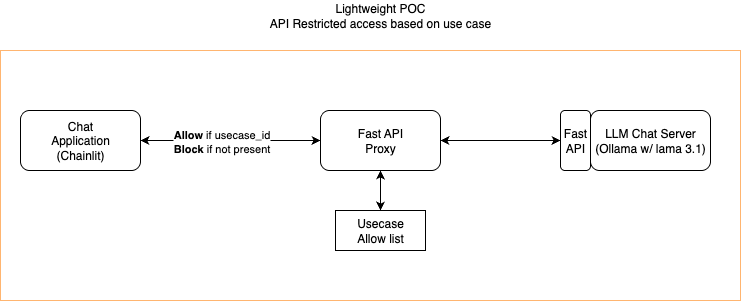

# Light Proxy for restricted access to an LLM chat API

Light poc to restrict access to an LLM Chat api based on some policy.  
We will implement a lightweight proxy that checks on policy condition before allowing or blocking traffic to the API.

This POC is ultiamtely to enable Model Governance and access to an LLM provider like Bedrock, OpenAI or [DataBricks Genie API](https://docs.databricks.com/aws/en/genie/conversation-api).
More specifically It checks for `X-Use-Case-ID` header presence and if its value belongs to an Allow list.


Target Flow:  
The Proxy would be envoy proxy and use an allow list of use cases and some filtering in `lua`.
See [readme_envoy](readme_envoy.md) for more information.




POC Flow:  
The POC would use a light Fast API proxy and a chainlit client app talking to Llama3.1 served locally via Ollama:



## 🔧 Setup Instructions
Install `uv` as package manager if you haven't already
```bash
pip install uv
```

The dependencies for this POC are tracked in `pyproject.tolml` and among others include:
```
fastapi uvicorn httpx chainlit ollama pydantic
```

To install them run
```bash
uv sync
```

###  Setup Instructions for Ollama:
1. Install Ollama:
Visit https://ollama.ai and install for your OS

Or use curl (Linux/Mac):
```bash
curl -fsSL https://ollama.ai/install.sh | sh
```
2. Start Ollama Service:
```bash
ollama serve
```
3. Pull Llama 3.1:
```bash
ollama pull llama3.1
```
4. Verify Installation:
```
bash
ollama list
```
Should show llama3.1 in the list


## Usage
Run in one terminal:
```bash
ollama run llama3.1
```

And in the other terminal:
```bash
uv run start_all.py
```

For this POC, we provide the ability to change use case id over time ad follow:
  1. Start with default: App starts with the configured default use-case ID
  2. Change use-case ID: Type /use-case 100001 to switch to a different ID
  3. Check current ID: Type /current-use-case to see what's currently set
  4. Get help: Type /help for command reference
  5. Chat normally: All regular messages use the current use-case ID

  The system now provides full flexibility for users to dynamically change their use-case ID without restarting the application, and all HTTP
  headers to the chat server will use the user's selected use-case ID.

---

## 🏗️ POC System Architecture
For a light POC, we will go with `Fast API` for the proxy, `Ollama` for the Chat server to mimin DataBricks chat api, and `Chainlit` for the app chat client as follow:

- FastAPI Proxy Server (Port 8001) - Controls traffic based on `X-Use-Case-ID` header
- Dummy Chat Server (Port 8002) - Backend service with the `/api/2.0/genie_dummy/spaces/start-conversation` endpoint. We will replace it down the road with the real Geni app (and part of appspace)
- Chainlit Client (Port 8000) - Interactive chat interface that emits the custom header
- Testing Scripts - Automated tests for different use case scenarios

## 🏗️ For Target System Architecture and Implementation
We would replace the Fast API with Envoy proxy and use `lua` filter or `http_filters` to inspect headers and allow or deny traffic.
WE would replace Ollama with an LLM Prpvoider like DataBricks Genie (or AWS Bedrock or Azure OpenAI).  


## 🎯 Key Features
#### Proxy Server:

- Validates `X-Use-Case-ID` against allowlist: `100000`, `100050`, `101966`, `102550`, `103366`
- Returns `400` for missing header, `403` for unauthorized values
- Comprehensive logging and monitoring
- Forwards all valid requests to backend

#### Traffic Control Logic:

- ✅ Allowed: chainlit-client (and other allowlisted IDs)
- ❌ Denied: Any unlisted use case ID
- ❌ Denied: Missing header entirely

#### Demo Flow:

- Open Chainlit at `http://localhost:8000`
- Send messages through the chat interface
- Messages route through proxy → chat server → back to client
- Try changing `USE_CASE_ID` in `chainlit_app.p`y` to test denials

### 🧪 Testing
- Run the test script to verify different scenarios:
```bash
uv run test_proxy.py
```
This will test valid use cases, invalid ones, and missing headers to demonstrate the proxy's access control in action.
The system showcases real-world proxy patterns while being lightweight enough for proof-of-concept development!

### 🛠️ Config CLI:
This tool makes it easy to manage your use case allowlist without touching code!RetryClaude does not have the ability to run the code it generates yet.
#### 🎯 Features:
✅ Error handling - Prevents duplicates, handles missing files  
✅ Backup creation - Automatic backups before destructive operations  
✅ Bulk operations - Import/export multiple use cases  
✅ Validation - Check use case permissions  
✅ Help system - Built-in help with examples  
✅ Safe operations - Confirmation prompts for destructive actions  z

#### Basic Commands:

- list - Show all current use cases
- add - Add a new use case (with optional description)
- remove - Remove an existing use case
- validate - Check if a use case ID is allowed
- show - Display full configuration
-reset - Reset to default configuration (with backup)

#### Advanced Commands:

- bulk-add - Import use cases from a text file
- export - Export use cases to a text file

Usage example
```bash
# List all current use cases
python config_cli.py list

# Add a new use case with description
python config_cli.py add "200000" -d "New mobile application"

# Remove a use case
python config_cli.py remove "100050"

# Validate if a use case is allowed
python config_cli.py validate "100000"

# Show full configuration
python config_cli.py show

# Bulk import from file
python config_cli.py bulk-add use_cases.txt

# Export to file
python config_cli.py export my_use_cases.txt

# Reset to defaults (creates backup)
python config_cli.py reset
```

Bulk command example:
Create a text file like `use_cases.txt`:
```text
# Comments start with #
100000:Primary client application
100050:Mobile app v2
101966:Analytics dashboard
102550:Admin panel interface
103366:External API integration

# Lines without colons are use cases without descriptions
200000
300000
```

---

## Requirements

### Header naming convention
The Client will emit (or not) a custom http header: `X-Usecase-ID`.

### Client Implementation
- Include the header on every relevant request
- Set it at the HTTP client/library level rather than per-request when possible
- Use configuration or environment variables to manage the usecase-id value
- Use a usecase-id value that is logged into our LUMA governance DB

### Proxy Configuration Considerations
#### Header Validation:

- Implement allowlists of valid usecase-id values
- Reject requests with malformed or unknown values
- Consider case sensitivity (recommend case-insensitive matching)

#### Traffic Control Logic:
- Use the header for access control (we can also use it down the road for routing and rate limiting)
 - Allow if `X-Usecase-ID` exists AND the value is in the allowlists
 - Block if the `X-Usecase-ID` is missng OR the value is missing from the allowlists


#### Logging and Oservability
- Log header values for audit monitoring and debugging