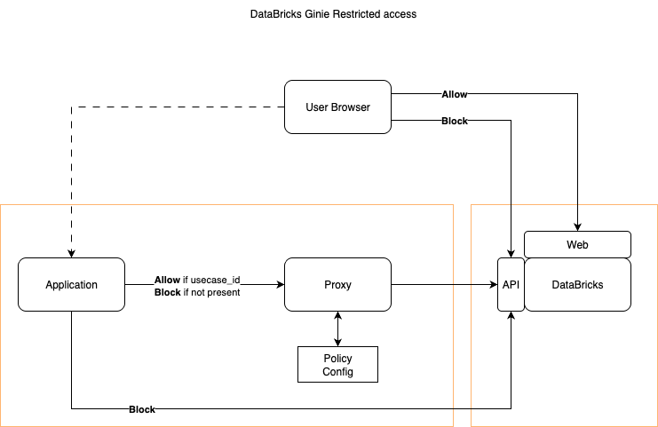

# Light Proxy for restricted access to DataBricks Genie API

Light poc to restrict access to DataBrikcs Genie API basedon some policy.
We will implement a lightweight proxy that checks on policy condition before allowing or blocking traffic to [DataBricks Genie API]https://docs.databricks.com/aws/en/genie/conversation-api)




## 🔧 Setup Instructions
Install `uv` as package manager if you haven't already
```bash
pip install uv
```

The dependencies for this POC are tracked in `pyproject.tolml` and among others include:
```
fastapi uvicorn httpx chainlit ollama pydantic
```

To install them run
```bash
uv sync
```


## Usage
Run:
```bash
uv run start_all.py
```


---
## 🏗️ System Architecture

- FastAPI Proxy Server (Port 8001) - Controls traffic based on `X-Use-Case-ID` header
- Dummy Chat Server (Port 8002) - Backend service with the `/api/2.0/genie_dummy/spaces/start-conversation` endpoint. We will replace it down the road with the real Geni app (and part of appspace)
- Chainlit Client (Port 8000) - Interactive chat interface that emits the custom header
- Testing Scripts - Automated tests for different use case scenarios


## 🎯 Key Features
#### Proxy Server:

- Validates `X-Use-Case-ID` against allowlist: `100000`, `100050`, `101966`, `102550`, `103366`
- Returns `400` for missing header, `403` for unauthorized values
- Comprehensive logging and monitoring
- Forwards all valid requests to backend

#### Traffic Control Logic:

- ✅ Allowed: chainlit-client (and other allowlisted IDs)
- ❌ Denied: Any unlisted use case ID
- ❌ Denied: Missing header entirely

#### Demo Flow:

- Open Chainlit at `http://localhost:8000`
- Send messages through the chat interface
- Messages route through proxy → chat server → back to client
- Try changing `USE_CASE_ID` in `chainlit_app.p`y` to test denials

### 🧪 Testing
- Run the test script to verify different scenarios:
```bash
uv run test_proxy.py
```
This will test valid use cases, invalid ones, and missing headers to demonstrate the proxy's access control in action.
The system showcases real-world proxy patterns while being lightweight enough for proof-of-concept development!

---

## Requirements

### Header naming convention
The Client will emit (or not) a custom http header: `X-Usecase-ID`.

### Client Implementation
- Include the header on every relevant request
- Set it at the HTTP client/library level rather than per-request when possible
- Use configuration or environment variables to manage the usecase-id value
- Use a usecase-id value that is logged into our LUMA governance DB

### Proxy Configuration Considerations
#### Header Validation:

- Implement allowlists of valid usecase-id values
- Reject requests with malformed or unknown values
- Consider case sensitivity (recommend case-insensitive matching)

#### Traffic Control Logic:
- Use the header for access control (we can also use it down the road for routing and rate limiting)
 - Allow if `X-Usecase-ID` exists AND the value is in the allowlists
 - Block if the `X-Usecase-ID` is missng OR the value is missing from the allowlists


#### Logging and Oservability
- Log header values for audit monitoring and debugging